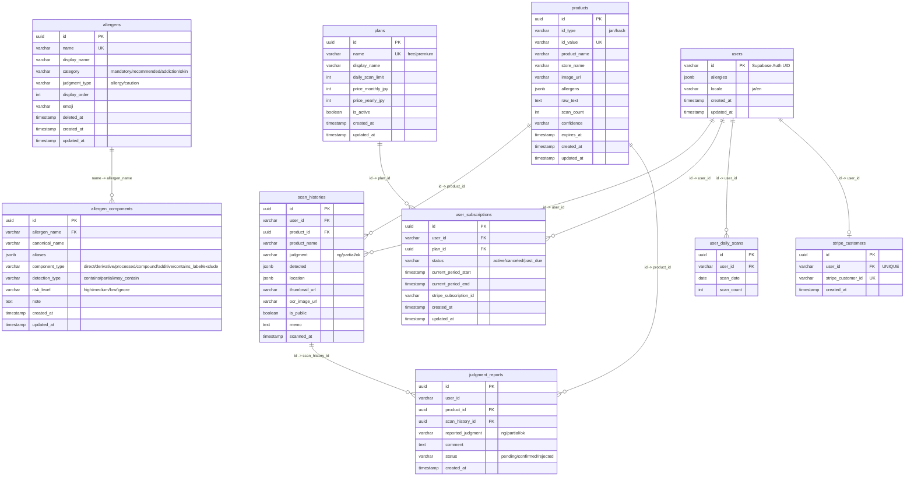

# UI/UX改善・機能追加 実装計画

> **エージェント向け:** REQUIRED SUB-SKILL: `executing-plans` または `subagent-driven-development` を使ってこの計画をタスクごとに実装すること。ステップはチェックボックス構文（`- [ ]`）で追跡。

**目標:** 履歴ページのPC/タブレット2カラム化・スキャン画面のファイルアップロードUI追加とカウンター/注意文の視認性改善・設定画面のaddiction/skinアコーディオン改善とプラン変更UIプレースホルダー追加・database.mdのER図Mermaidエラー修正を一括で実施する

**アーキテクチャ:** フロントエンドのみの変更。`useScan.uploadAndScanImage(file)` は既存実装を活用（スキャンカウントは OCR エンドポイント経由で自動インクリメント）。アコーディオンのデフォルト状態は「グループ内に有効設定があれば開く」ロジックで制御。

**技術スタック:** Next.js App Router / TypeScript / Tailwind CSS / next-intl

---

## 変更ファイル一覧

| ファイル | 変更内容 |
|---|---|
| `frontend/src/app/history/page.tsx` | カードリストを lg 以上で 2 カラムグリッドに変更 |
| `frontend/src/components/molecules/ScanLimitBadge.tsx` | カメラオーバーレイ上で視認できる背景付きバッジに変更 |
| `frontend/src/app/scan/page.tsx` | 注意文をオーバーレイ内に移動・ファイルアップロードボタン追加 |
| `frontend/src/app/settings/page.tsx` | addiction/skin アコーディオン対応・スマートデフォルト・プラン変更UI |
| `frontend/public/locales/ja/settings.json` | プラン変更UIのi18nキー追加 |
| `frontend/public/locales/en/settings.json` | プラン変更UIのi18nキー追加 |
| `docs/design/database.md` | ER図のMermaid構文エラー修正（Unicode矢印・重複キー） |

---

## Task 1: 履歴ページ PC/タブレット 2カラムグリッド

**Files:**
- Modify: `frontend/src/app/history/page.tsx:98,153`

**背景:**  
PC (1440px) でカードが `max-w-120`（480px）の単一カラムに集中し、左右に大量の余白。`lg:max-w-3xl`（768px）でも単一カラムのまま。2カラムグリッドにしてコンテンツ密度を上げる。

- [ ] **Step 1: カードリストを 2カラムグリッドに変更する**

`frontend/src/app/history/page.tsx` の `<ul className="space-y-3">` を以下に変更（自分のスキャンタブ・みんなのスキャンタブ両方）:

```tsx
{/* 自分のスキャン カードリスト（line 153） */}
<ul className="grid grid-cols-1 lg:grid-cols-2 lg:gap-4 space-y-3 lg:space-y-0">
  {myItems.map((item) => (
    <li key={item.id}>
      <HistoryCard
        item={item}
        isOwner={item.userId === userId}
        onEdit={handleEditOpen}
        onDelete={handleDelete}
      />
    </li>
  ))}
</ul>

{/* みんなのスキャン カードリスト（line 199） */}
<ul className="grid grid-cols-1 lg:grid-cols-2 lg:gap-4 space-y-3 lg:space-y-0">
  {othersItems.map((item) => (
    <li key={item.id}>
      {item.is_expired && (
        <p className="text-xs text-amber-600 mb-1">{t('expiredTag')}</p>
      )}
      <HistoryCard
        item={{
          id: item.id,
          userId: '',
          productId: item.id,
          productName: item.product_name,
          judgment: item.judgment,
          detected: item.detected,
          thumbnail_url: null,
          ocr_image_url: null,
          is_public: true,
          memo: null,
          scannedAt: item.updated_at,
        }}
      />
    </li>
  ))}
</ul>
```

また `<main>` の `max-w-120 lg:max-w-3xl` を `max-w-120 lg:max-w-5xl` に変更してPC幅を広げる:

```tsx
<main className="flex flex-col min-h-screen max-w-120 lg:max-w-5xl mx-auto px-4 pb-20 lg:pb-8 pt-6">
```

- [ ] **Step 2: Chrome で PC 幅 (1440px) と タブレット幅 (768px) を確認する**

```
mcp__chrome-devtools__navigate_page: http://localhost:3000/history
mcp__chrome-devtools__resize_page: { width: 1440, height: 900 }
mcp__chrome-devtools__take_screenshot
mcp__chrome-devtools__resize_page: { width: 768, height: 1024 }
mcp__chrome-devtools__take_screenshot
```

期待: 1440px でカードが 2 カラムに並ぶ。768px で 1 カラムのまま。

- [ ] **Step 3: コミット**

```bash
git add frontend/src/app/history/page.tsx
git commit -m "feat: 2-column grid layout for history page on lg screens"
```

---

## Task 2: ScanLimitBadge 視認性改善

**Files:**
- Modify: `frontend/src/components/molecules/ScanLimitBadge.tsx`

**背景:**  
カメラオーバーレイ上に `text-xs text-muted-foreground` のみで表示されているため、明るい背景に対して視認困難。背景付きバッジに変更する。

- [ ] **Step 1: バッジスタイルを改善する**

`frontend/src/components/molecules/ScanLimitBadge.tsx` を以下に書き換える:

```tsx
'use client'

type Props = {
  used: number
  limit: number
}

const NEAR_LIMIT_RATIO = 0.8

export const ScanLimitBadge = ({ used, limit }: Props) => {
  const isNearLimit = used >= limit * NEAR_LIMIT_RATIO
  const isAtLimit = used >= limit

  const colorClass = isAtLimit
    ? 'bg-red-600 text-white'
    : isNearLimit
      ? 'bg-yellow-500 text-white'
      : 'bg-black/50 text-white'

  return (
    <span
      className={`inline-flex items-center px-2.5 py-1 rounded-full text-xs font-bold backdrop-blur-sm ${colorClass}`}
    >
      {used} / {limit}
    </span>
  )
}
```

- [ ] **Step 2: Chrome でスキャン画面のバッジを確認する**

```
mcp__chrome-devtools__navigate_page: http://localhost:3000/scan
mcp__chrome-devtools__take_screenshot
```

期待: カメラ映像の上に「0 / 20」が背景付き丸バッジで明瞭に表示される。

- [ ] **Step 3: コミット**

```bash
git add frontend/src/components/molecules/ScanLimitBadge.tsx
git commit -m "feat: improve ScanLimitBadge visibility with background pill on camera overlay"
```

---

## Task 3: スキャン画面 注意文の常時表示とレイアウト整理

**Files:**
- Modify: `frontend/src/app/scan/page.tsx:104,126-136,141-143`

**背景:**  
注意文（⚠️ 購入前に...）がカメラ映像の外側（下）に配置されており、スクロールしないと見えない。オーバーレイ内に移動して常時表示する。また撮影ボタンエリアにまとめる。

- [ ] **Step 1: カメラ画面の注意文をオーバーレイ内に移動する**

`frontend/src/app/scan/page.tsx` のカメラ画面部分（`// カメラ画面（idle / processing / error）` から）を以下に変更:

```tsx
// カメラ画面（idle / processing / error）
return (
  <AppLayout>
    <LoadingOverlay isOpen={scanState === 'processing'} message={t('processing')} />

    <div className="relative flex h-[calc(100dvh-4rem)] flex-col lg:h-screen">
      <video
        ref={videoRef}
        autoPlay
        playsInline
        muted
        className="h-full w-full object-cover"
        aria-label={t('camera.videoLabel')}
      />

      <div className="absolute inset-0 flex flex-col justify-between p-4">
        {/* 上部: スキャン使用量バッジ + カメラ切り替え */}
        <div className="flex items-center justify-between">
          {scanUsage !== null && (
            <ScanLimitBadge used={scanUsage.used} limit={scanUsage.limit} />
          )}
          <button
            onClick={toggleFacingMode}
            aria-label={t('camera.switchCamera')}
            className="rounded-full bg-black/40 p-2 text-white lg:hidden"
          >
            🔄
          </button>
        </div>

        {/* 中央: エラーメッセージ */}
        {error && (
          <div className="mx-auto rounded-lg bg-black/60 px-4 py-2 text-sm text-white">
            {t(`error.${error}`)}
          </div>
        )}

        {/* 下部: 注意文 + 撮影ボタン */}
        <div className="flex flex-col items-center gap-3 pb-4">
          {/* ⚠️ 安全設計: オーバーレイ内に配置して常時視認可能にする（省略禁止） */}
          <p className="rounded-lg bg-black/50 px-3 py-1.5 text-center text-xs text-white backdrop-blur-sm">
            {t('caution')}
          </p>
          {/* タップ撮影ボタン */}
          <button
            onClick={handleCapture}
            disabled={scanState === 'processing'}
            aria-label={t('capture')}
            className="h-20 w-20 rounded-full border-4 border-white bg-white/20 backdrop-blur-sm transition-opacity disabled:opacity-50"
          >
            <span className="text-2xl">📷</span>
          </button>
        </div>
      </div>
    </div>
  </AppLayout>
)
```

**注意:** カメラ画面外側の `<p className="p-2 text-center text-xs text-muted-foreground">` (line 141-143) は上記に統合したため削除する。

- [ ] **Step 2: Chrome でスキャン画面を確認する**

```
mcp__chrome-devtools__navigate_page: http://localhost:3000/scan
mcp__chrome-devtools__take_screenshot
```

期待: 注意文がカメラ映像の下部オーバーレイ内に半透明背景付きで表示され、スクロール不要で見える。

- [ ] **Step 3: コミット**

```bash
git add frontend/src/app/scan/page.tsx
git commit -m "feat: move caution text inside camera overlay for always-visible display"
```

---

## Task 4: スキャン画面 ファイルアップロードUI追加

**Files:**
- Modify: `frontend/src/app/scan/page.tsx`

**背景:**  
`useScan.uploadAndScanImage(file: File)` は既に実装済み。OCR フローを通るためスキャンカウント（0/20）も自動インクリメントされる。UIボタンのみ追加する。i18nキー `camera.uploadButton`（"画像から解析"）は ja/en 両方に存在する。

- [ ] **Step 1: ファイルアップロードボタンを撮影ボタンの隣に追加する**

Task 3 で変更した `scan/page.tsx` の「下部: 注意文 + 撮影ボタン」セクションを以下に変更:

```tsx
{/* 下部: 注意文 + 撮影ボタン + アップロードボタン */}
<div className="flex flex-col items-center gap-3 pb-4">
  {/* ⚠️ 安全設計: オーバーレイ内に配置して常時視認可能にする（省略禁止） */}
  <p className="rounded-lg bg-black/50 px-3 py-1.5 text-center text-xs text-white backdrop-blur-sm">
    {t('caution')}
  </p>
  <div className="flex items-center gap-6">
    {/* タップ撮影ボタン */}
    <button
      onClick={handleCapture}
      disabled={scanState === 'processing'}
      aria-label={t('capture')}
      className="h-20 w-20 rounded-full border-4 border-white bg-white/20 backdrop-blur-sm transition-opacity disabled:opacity-50"
    >
      <span className="text-2xl">📷</span>
    </button>
    {/* ファイルアップロードボタン */}
    <label
      aria-label={t('camera.uploadButton')}
      className={`flex flex-col items-center gap-1 cursor-pointer rounded-2xl bg-black/40 px-4 py-3 text-white backdrop-blur-sm transition-opacity
        ${scanState === 'processing' ? 'opacity-50 pointer-events-none' : ''}`}
    >
      <span className="text-2xl">🖼️</span>
      <span className="text-xs font-medium">{t('camera.uploadButton')}</span>
      <input
        type="file"
        accept="image/*"
        className="sr-only"
        disabled={scanState === 'processing'}
        onChange={(e) => {
          const file = e.target.files?.[0]
          if (file) void uploadAndScanImage(file)
          // 同じファイルを再選択できるようにリセット
          e.target.value = ''
        }}
      />
    </label>
  </div>
</div>
```

また `useScan` から `uploadAndScanImage` を destructure に追加する（scan/page.tsx の useScan 呼び出し部分）:

```tsx
const {
  scanState,
  error,
  result,
  previewDataUrl,
  storeCandidates,
  onStoreSelect,
  videoRef,
  startScan,
  stopScan,
  reset,
  handleCapture,
  confirmAndScan,
  toggleFacingMode,
  uploadAndScanImage,   // ← 追加
} = useScan()
```

- [ ] **Step 2: Chrome でアップロードボタンの表示を確認する**

```
mcp__chrome-devtools__navigate_page: http://localhost:3000/scan
mcp__chrome-devtools__take_screenshot
```

期待: 撮影ボタンの右隣に「🖼️ 画像から解析」ボタンが表示される。

- [ ] **Step 3: 型チェックを通す**

```bash
pnpm --filter frontend typecheck
```

期待: エラーなし。

- [ ] **Step 4: コミット**

```bash
git add frontend/src/app/scan/page.tsx
git commit -m "feat: add file upload button to scan page wired to uploadAndScanImage"
```

---

## Task 5: 設定画面 addiction/skin アコーディオン改善

**Files:**
- Modify: `frontend/src/app/settings/page.tsx:72-165`

**背景:**  
現在 `recommended` カテゴリーのみアコーディオン制御あり（localStorage永続化）。`addiction`・`skin` カテゴリーは常に展開状態でトグル不可。

**要件:**
- `mandatory` 以外（`recommended`・`addiction`・`skin`）はすべてアコーディオン表示
- デフォルト状態: グループ内に1つでも enabled な設定があれば開く、なければ閉じる
- ユーザーが手動で開閉したら localStorage に保存して次回も維持する
- ストレージキー: `allergen_accordion_${category}` （既存の `allergen_accordion_recommended` と互換）

- [ ] **Step 1: AllergenSection のアコーディオンロジックを更新する**

`frontend/src/app/settings/page.tsx` の `AllergenSection` コンポーネントを以下に変更:

```tsx
type AllergenSectionProps = {
  group: AllergenGroup
  allergies: Record<string, { enabled: boolean; partialAlert: boolean }>
  onToggleAllergen: (name: string) => void
  onToggleCaution: (name: string) => void
  t: TranslateFn
}

const AllergenSection = ({
  group,
  allergies,
  onToggleAllergen,
  onToggleCaution,
  t,
}: AllergenSectionProps) => {
  const isMandatory = group.category === 'mandatory'
  const storageKey = `allergen_accordion_${group.category}`

  const [isExpanded, setIsExpanded] = useState(() => {
    // mandatory は常に展開（アコーディオンなし）
    if (isMandatory) return true
    if (typeof window === 'undefined') return true
    const stored = localStorage.getItem(storageKey)
    if (stored !== null) return stored === 'true'
    // 初回（localStorage未設定）: 1つでも有効設定があれば開く
    return group.items.some((item) => allergies[item.name]?.enabled === true)
  })

  const handleToggle = () => {
    setIsExpanded((prev) => {
      const next = !prev
      if (typeof window !== 'undefined') {
        localStorage.setItem(storageKey, String(next))
      }
      return next
    })
  }

  return (
    <section className="mb-4">
      {isMandatory ? (
        <div className="mb-2 px-0.5">
          <h2 className="text-sm font-semibold text-gray-500 uppercase tracking-wide">
            {t(`allergens.category.${group.category}`)}
          </h2>
        </div>
      ) : (
        <button
          type="button"
          onClick={handleToggle}
          aria-expanded={isExpanded}
          className="w-full flex items-center justify-between mb-2
            bg-gray-100 border border-gray-200 rounded-lg px-3 py-2
            cursor-pointer hover:bg-gray-200 transition-colors
            focus:outline-none focus:ring-2 focus:ring-blue-500"
        >
          <h2 className="text-sm font-semibold text-gray-600">
            {t(`allergens.category.${group.category}`)}
          </h2>
          <svg
            viewBox="0 0 24 24"
            fill="none"
            stroke="currentColor"
            strokeWidth="2.5"
            strokeLinecap="round"
            strokeLinejoin="round"
            className={`w-5 h-5 text-gray-500 transition-transform duration-200 ${
              isExpanded ? 'rotate-180' : ''
            }`}
            aria-hidden="true"
          >
            <polyline points="6 9 12 15 18 9" />
          </svg>
        </button>
      )}

      {isExpanded && (
        <ul className="bg-white rounded-xl shadow-sm divide-y divide-gray-100 overflow-hidden">
          {group.items.map((item) => {
            const setting = allergies[item.name] ?? {
              enabled: false,
              partialAlert: false,
            }
            const isAllergy =
              group.category === 'mandatory' || group.category === 'recommended'
            return (
              <AllergenToggleRow
                key={item.name}
                item={item}
                enabled={setting.enabled}
                onToggle={() =>
                  isAllergy
                    ? onToggleAllergen(item.name)
                    : onToggleCaution(item.name)
                }
              />
            )
          })}
        </ul>
      )}
    </section>
  )
}
```

古い `ACCORDION_STORAGE_KEY` 定数（`'allergen_accordion_recommended'`）は削除する（新ロジックで動的生成するため不要）。

- [ ] **Step 2: Chrome で設定画面を確認する（addiction/skin が閉じた状態で表示）**

```
mcp__chrome-devtools__navigate_page: http://localhost:3000/settings
mcp__chrome-devtools__take_screenshot
```

期待: 「依存性への配慮」「肌への配慮」セクションがアコーディオンとして表示され、設定なしなら閉じた状態になる。

- [ ] **Step 3: 型チェック**

```bash
pnpm --filter frontend typecheck
```

- [ ] **Step 4: コミット**

```bash
git add frontend/src/app/settings/page.tsx
git commit -m "feat: accordion for addiction/skin allergen categories with smart default open state"
```

---

## Task 6: 設定画面 プラン変更UI（プレースホルダー）

**Files:**
- Modify: `frontend/src/app/settings/page.tsx:321-330`
- Modify: `frontend/public/locales/ja/settings.json`
- Modify: `frontend/public/locales/en/settings.json`

**背景:**  
現在はサブスクリプション情報の表示のみ。プラン変更エンドポイント（`PATCH /admin/users/:id/plan`）はadmin専用のため、ユーザー向けのStripe連携は Phase 1 pending。UIシェルのみ追加し、Stripe連携時に差し込める形にする。

- [ ] **Step 1: i18nキーを追加する**

`frontend/public/locales/ja/settings.json` に以下を追加（`"plan"` キーの後）:

```json
"planUpgrade": "プランを変更する",
"planUpgradeComingSoon": "プラン変更機能は近日公開予定です。ご要望はサポートまでお問い合わせください。",
"planUpgradeContact": "お問い合わせ"
```

`frontend/public/locales/en/settings.json` に以下を追加（対応箇所）:

```json
"planUpgrade": "Change Plan",
"planUpgradeComingSoon": "Plan upgrade is coming soon. Please contact support for inquiries.",
"planUpgradeContact": "Contact Support"
```

- [ ] **Step 2: プラン変更UIを設定ページに追加する**

`frontend/src/app/settings/page.tsx` のサブスクリプションセクション（`{userSettings?.subscription && (...)}` ブロック）を以下に変更:

```tsx
{userSettings?.subscription && (
  <section className="rounded-lg border border-gray-200 bg-white shadow-sm p-4 mb-8">
    <h2 className="text-base font-bold text-gray-800 mb-3">{t('plan')}</h2>
    <div className="flex items-center justify-between">
      <div>
        <p className="text-sm font-medium text-gray-700">
          {userSettings.subscription.plan_name}
        </p>
        <p className="text-xs text-gray-500 mt-0.5">
          {t('dailyLimit', { limit: userSettings.subscription.daily_scan_limit })}
        </p>
      </div>
      <button
        type="button"
        onClick={() => alert(t('planUpgradeComingSoon'))}
        className="shrink-0 ml-4 px-4 py-2 rounded-lg bg-blue-50 text-blue-700 text-sm font-medium
          border border-blue-200 hover:bg-blue-100 transition-colors
          focus:outline-none focus:ring-2 focus:ring-blue-500 focus:ring-offset-2"
      >
        {t('planUpgrade')}
      </button>
    </div>
  </section>
)}
```

> ⚠️ `alert()` は Stripe 連携実装時にモーダルまたは Stripe Checkout リンクに差し替える。

- [ ] **Step 3: 型チェック**

```bash
pnpm --filter frontend typecheck
```

- [ ] **Step 4: Chrome で設定画面のプランセクションを確認する**

```
mcp__chrome-devtools__navigate_page: http://localhost:3000/settings
mcp__chrome-devtools__take_screenshot
```

期待: サブスクリプションセクションにプラン名・日次上限と「プランを変更する」ボタンが横並びで表示される。

- [ ] **Step 5: コミット**

```bash
git add frontend/src/app/settings/page.tsx \
  frontend/public/locales/ja/settings.json \
  frontend/public/locales/en/settings.json
git commit -m "feat: add plan upgrade button placeholder in settings (Stripe wiring pending)"
```

---

---

## Task 7: docs/design/database.md ER図 Mermaidエラー修正

**Files:**
- Modify: `docs/design/database.md:28-153`

**背景:**  
ER図がVS CodeのMermaidプレビューでエラーになっている。原因は2つ:

1. **`→`（U+2192 RIGHTWARDS ARROW）** — Mermaidのレクサーはリレーションラベル内のUnicode矢印を処理できない。ASCIIの `->` に置換する
2. **`FK UK`（スペース区切り二重キー）** — `stripe_customers.user_id` で `FK UK` と2つのキーをスペース区切りで並べているが、Mermaid erDiagramのパーサーは1属性に1キーしか受け付けない。`FK` のみに変更し、UNIQUEであることは属性名のコメントで補う

- [ ] **Step 1: ER図ブロック（line 28-153）を修正版に置き換える**

`docs/design/database.md` の ` ```mermaid ` ブロック全体を以下に置き換える:

````markdown

````

**変更点のみ抜粋:**
- 9箇所のリレーションラベル: `"name → allergen_name"` → `"name -> allergen_name"` （他も同様）
- `stripe_customers.user_id`: `FK UK` → `FK "UNIQUE"` （UKをコメントで表現）

- [ ] **Step 2: VS Code の Mermaid プレビューでエラーが消えることを確認する**

VS Code で `docs/design/database.md` を開き、右上の「Open Preview」またはMarkdownプレビューでER図が正常レンダリングされることを目視確認する。

- [ ] **Step 3: コミット**

```bash
git add docs/design/database.md
git commit -m "fix: resolve Mermaid erDiagram parse errors (Unicode arrow, dual key notation)"
```

---

## セルフレビュー

### 仕様カバレッジ

| 要件 | 対応タスク |
|---|---|
| 履歴ページ タブレット/PC で小さすぎる | Task 1 |
| スキャンページ ファイルアップロード機能なし | Task 4 |
| ファイルアップロード OCR でも 0/20 カウントアップ | Task 4（`uploadAndScanImage` → OCR エンドポイント経由で自動） |
| 「0/20」が見にくい | Task 2 |
| スクロール時に注意文に気づきにくい | Task 3 |
| 設定でアルコール等（addiction/skin）の設定ができない | Task 5 |
| 設定あり→アコーディオン開、設定なし→閉 | Task 5 |
| 設定画面でプラン変更できない | Task 6 |
| database.md ER図がプレビューエラー | Task 7 |

### プレースホルダースキャン

- Task 6 の `alert()` は意図的なプレースホルダー（コメントで明示済み）

### 型一貫性

- `AllergenSection` の `allergies` prop は既存のまま `Record<string, { enabled; partialAlert }>` を使用
- `uploadAndScanImage` は既存 `UseScanReturn` に定義済み
- i18n の `t()` 呼び出しはすべて追加するキーに対応

---

**計画を `.claude/plans/pending/2026-06-06-ui-ux-improvements.md` に保存しました。実行方法を選んでください:**

**1. サブエージェント駆動（推奨）** — タスクごとに新しいサブエージェントを派遣、タスク間でレビュー

**2. インライン実行** — このセッション内で `executing-plans` を使って実行

**どちらにしますか？**
