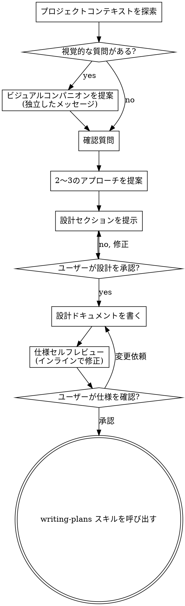

# ブレインストーミング — アイデアを設計に変える

アイデアを自然な対話を通じて完全に形になった設計・仕様に変換する。

プロジェクトの現在のコンテキストを理解し、質問を一つずつ行い、アイデアを精緻化する。何を作るか理解できたら、設計を提示してユーザーの承認を得る。

<HARD-GATE>
設計を提示してユーザーが承認するまで、実装スキルを呼び出したり、コードを書いたり、プロジェクトをスキャフォールドしたり、いかなる実装アクションも取ってはならない。プロジェクトの規模に関わらず、これは絶対に適用される。
</HARD-GATE>

## アンチパターン: 「これは設計不要なほど単純」

すべてのプロジェクトはこのプロセスを経る。todo リスト、単一関数ユーティリティ、設定変更 — どれも同じ。「単純な」プロジェクトこそ、未検証の前提が最も多くの無駄な作業を引き起こす。設計は短くてよい（本当に単純なプロジェクトなら数文）が、必ず提示して承認を得ること。

## チェックリスト

以下の各項目のタスクを TodoWrite で作成し、順番通りに完了させること:

1. **プロジェクトコンテキストを探索** — ファイル、ドキュメント、最近のコミットを確認
2. **ビジュアルコンパニオンの提案** (視覚的な質問が含まれる場合) — これは独立したメッセージで、確認質問と組み合わせない
3. **確認質問** — 一度に一つ、目的・制約・成功基準を理解する
4. **2〜3のアプローチを提案** — トレードオフと推奨案を提示
5. **設計を提示** — 複雑さに応じたセクションで、各セクション後に承認を得る
6. **設計ドキュメントを書く** — `docs/specs/YYYY-MM-DD-<topic>-design.md` に保存してコミット
7. **仕様セルフレビュー** — プレースホルダー・矛盾・曖昧さ・スコープを確認（以下参照）
8. **ユーザーが仕様を確認** — 進む前に仕様ファイルをレビューするよう依頼
9. **実装へ移行** — `writing-plans` スキルを呼び出して実装計画を作成

## プロセスフロー

**終端状態は `writing-plans` の呼び出し。** frontend-design や他の実装スキルを呼び出してはならない。brainstorming の後に呼び出す唯一のスキルは `writing-plans`。

## プロセスの詳細

**アイデアを理解する:**
- 先にプロジェクトの現状を確認（ファイル、ドキュメント、最近のコミット）
- 詳細な質問をする前に、スコープを評価する。リクエストが複数の独立したサブシステムを記述している場合（例: 「チャット・ファイルストレージ・課金・分析を持つプラットフォームを作る」）、直ちに指摘する。分解が必要なプロジェクトの詳細を精緻化するために質問を費やさないこと
- 適切なスコープのプロジェクトについては、一度に一つの質問でアイデアを精緻化
- 可能であれば選択肢形式の質問を優先、オープンエンドでも可
- メッセージごとに質問は一つ — さらなる探索が必要なら複数の質問に分ける
- 理解に集中: 目的、制約、成功基準

**アプローチを探索する:**
- トレードオフを伴う 2〜3 の異なるアプローチを提案
- 推奨案と理由を会話形式で提示
- 推奨オプションを先頭に置き、なぜそれを推奨するか説明

**設計を提示する:**
- 何を作るか理解できたと思ったら設計を提示
- 各セクションを複雑さに応じてスケール: 簡単なら数文、微妙なら 200〜300 語まで
- 各セクション後に「ここまでは正しいですか?」と確認
- カバーする内容: アーキテクチャ、コンポーネント、データフロー、エラーハンドリング、テスト
- 何かがおかしいと感じたら、戻って確認する準備をする

**既存コードベースでの作業:**
- 変更を提案する前に現在の構造を探索。既存パターンに従う
- 作業に影響する問題（大きくなりすぎたファイル、不明確な境界など）は、設計の一部として改善を含める
- 無関係なリファクタリングは提案しない。現在の目標に集中する

## 設計後の処理

**ドキュメント:**
- 検証済みの設計（仕様）を `docs/specs/YYYY-MM-DD-<topic>-design.md` に保存
- 設計ドキュメントを git にコミット

**仕様セルフレビュー:**
仕様ドキュメントを書いた後、新鮮な目でチェック:

1. **プレースホルダースキャン:** "TBD"、"TODO"、不完全なセクション、曖昧な要件がないか確認。あれば修正。
2. **内部一貫性:** セクション間の矛盾はないか。アーキテクチャと機能説明は一致しているか。
3. **スコープチェック:** 単一の実装計画として集中できるか、分解が必要か。
4. **曖昧さチェック:** 二通りに解釈できる要件はないか。あれば一方を選んで明確にする。

問題があればインラインで修正する。

**ユーザーレビューゲート:**
仕様レビューが通ったら、進む前にユーザーに確認を依頼:

> 「仕様を `<path>` に書いてコミットしました。実装計画を始める前にレビューして、変更があればお知らせください。」

ユーザーの返答を待つ。変更が依頼されたら修正して仕様レビューループを再実行。承認されたら進む。

**実装:**
- `writing-plans` スキルを呼び出して詳細な実装計画を作成
- 他のスキルを呼び出してはならない。`writing-plans` が次のステップ。

## 主要原則

- **一度に一つの質問** — 複数の質問で圧倒しない
- **選択肢形式を優先** — 可能であれば、オープンエンドより答えやすい
- **YAGNI を徹底** — 不要な機能はすべての設計から除去
- **代替案を探索** — 決定する前に必ず 2〜3 のアプローチを提案
- **段階的な検証** — 設計を提示し、先に進む前に承認を得る
- **柔軟に** — 何かがおかしいと感じたら戻って確認する
