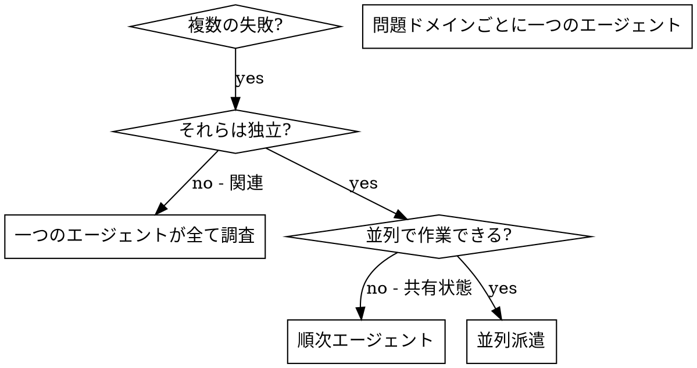

# 並列エージェントの派遣

## 概要

特定のコンテキストと指示を持つ専門エージェントにタスクを委任する。彼らはセッションのコンテキストや履歴を継承しない — 必要なものを正確に構築する。

複数の無関連な失敗がある場合（異なるテストファイル、異なるサブシステム、異なるバグ）、順番に調査すると時間が無駄になる。各調査は独立していて並列に行える。

**コアプリンシパル:** 独立した問題ドメインごとに一つのエージェントを派遣する。並行して作業させる。

## 使用タイミング



**使用する場合:**
- 3 件以上のテストファイルが異なる根本原因で失敗している
- 複数のサブシステムが独立して壊れている
- 各問題は他のコンテキストなしに理解できる
- 調査間に共有状態がない

**使用しない場合:**
- 失敗が関連している（一つを修正すると他も修正される可能性）
- 完全なシステム状態を理解する必要がある
- エージェントが互いに干渉する

## パターン

### 1. 独立したドメインを特定する

失敗を壊れているものでグループ化:
- ファイル A のテスト: ツール承認フロー
- ファイル B のテスト: バッチ完了動作
- ファイル C のテスト: 中断機能

各ドメインは独立している。

### 2. 焦点を当てたエージェントタスクを作成する

各エージェントには:
- **特定のスコープ:** 一つのテストファイルまたはサブシステム
- **明確な目標:** これらのテストをパスさせる
- **制約:** 他のコードを変更しない
- **期待される出力:** 見つけたことと修正したことの要約

### 3. 並列に派遣する

```typescript
// Claude Code / AI 環境
Task("agent-tool-abort.test.ts の失敗を修正する")
Task("batch-completion-behavior.test.ts の失敗を修正する")
Task("tool-approval-race-conditions.test.ts の失敗を修正する")
// 3 つすべてが同時に実行される
```

### 4. レビューと統合

エージェントが戻ってきたら:
- 各要約を読む
- 修正が競合しないことを確認する
- フルテストスイートを実行する
- すべての変更を統合する

## エージェントプロンプトの構造

良いエージェントプロンプトは:
1. **集中している** — 一つの明確な問題ドメイン
2. **自己完結している** — 問題を理解するために必要なすべてのコンテキスト
3. **出力について具体的** — エージェントは何を返すべきか？

```markdown
src/scan/scan.service.spec.ts の 3 件の失敗テストを修正する:

1. "should process barcode scan" - JANコード照合が失敗している
2. "should handle OCR result" - アレルゲン判定のモックが一致しない
3. "should save scan history" - prismaのモックが呼ばれていない

タイミング/モックの問題と思われる。タスク:

1. テストファイルを読んで各テストが何を検証するか理解する
2. 根本原因を特定する
3. 修正する:
   - 任意のタイムアウトをイベントベースの待機に置き換える
   - 実際のバグが見つかれば修正する
   - 動作が変更された場合はテストの期待値を調整する

タイムアウトを増やすだけの修正はしない — 実際の問題を見つける。

返却: 見つけたことと修正したことの要約。
```

## 一般的なミス

**❌ 広すぎる:** 「すべてのテストを修正する」— エージェントが迷子になる
**✅ 具体的:** 「scan.service.spec.ts を修正する」— 焦点を当てたスコープ

**❌ コンテキストなし:** 「競合状態を修正する」— エージェントはどこか分からない
**✅ コンテキストあり:** エラーメッセージとテスト名を貼り付ける

**❌ 制約なし:** エージェントが何でもリファクタリングする可能性
**✅ 制約あり:** 「プロダクションコードを変更しない」または「テストのみ修正」

## 検証

エージェントが戻ってきたら:
1. **各要約を確認** — 何が変わったか理解する
2. **競合を確認** — エージェントは同じコードを編集したか？
3. **フルスイートを実行** — すべての修正が一緒に機能することを確認する
4. **スポットチェック** — エージェントは体系的なエラーを犯す可能性がある
