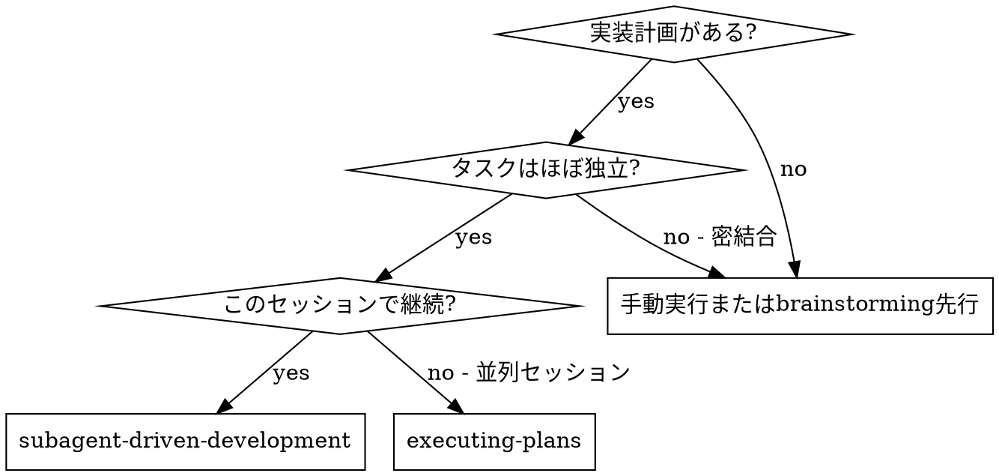
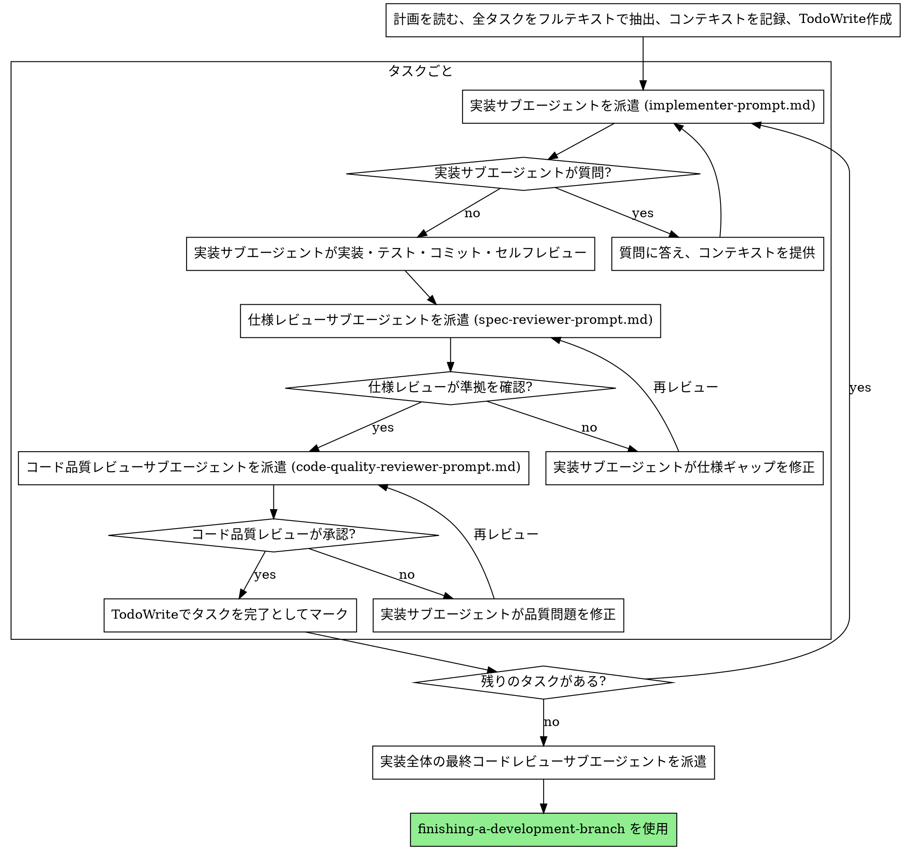

# サブエージェント駆動開発

現在のセッションでタスクごとに新しいサブエージェントを派遣し、各タスク後に二段階のレビュー（仕様準拠レビューを先に、次にコード品質レビュー）を行うことで計画を実行する。

**サブエージェントを使う理由:** 特定のコンテキストと指示を持つ専門エージェントにタスクを委任する。彼らはセッションのコンテキストや履歴を継承しない — 必要なものを正確に構築する。これにより自分のコンテキストをコーディネーション作業のために保護する。

**コアプリンシパル:** タスクごとに新しいサブエージェント + 二段階のレビュー（仕様 → 品質）= 高品質、高速なイテレーション

**継続的な実行:** タスク間にパートナーに確認するために一時停止しない。停止する理由は: 解決できないブロック状態、本当に進行を妨げる曖昧さ、またはすべてのタスク完了のみ。進捗サマリーは時間を無駄にする — 計画を実行するよう依頼されたので、実行する。

## 使用タイミング

## プロセス

## モデル選択

コストを節約してスピードを上げるために、各役割を処理できる最も非力なモデルを使用。

- **機械的な実装タスク**（独立した関数、明確な仕様、1〜2 ファイル）: 高速で安価なモデル
- **統合と判断タスク**（マルチファイル調整、パターンマッチング、デバッグ）: 標準モデル
- **アーキテクチャ、設計、レビュータスク**: 最も能力の高いモデル

## 実装サブエージェントのステータス処理

サブエージェントは 4 つのステータスのうちの一つを報告する:

**DONE:** 仕様準拠レビューに進む。

**DONE_WITH_CONCERNS:** 作業を完了したが懸念を指摘した。レビューに進む前に懸念を読む。

**NEEDS_CONTEXT:** 提供されなかった情報が必要。不足しているコンテキストを提供して再派遣。

**BLOCKED:** タスクを完了できない。ブロッカーを評価:
1. コンテキストの問題なら、より多くのコンテキストを提供して同じモデルで再派遣
2. より多くの推論が必要なら、より能力の高いモデルで再派遣
3. タスクが大きすぎるなら、小さな部分に分割
4. 計画自体が間違っているなら、ユーザーにエスカレーション

## プロンプトテンプレート

- `./implementer-prompt.md` — 実装サブエージェントを派遣
- `./spec-reviewer-prompt.md` — 仕様準拠レビューサブエージェントを派遣
- `./code-quality-reviewer-prompt.md` — コード品質レビューサブエージェントを派遣

## Red Flags

**絶対にしてはいけない:**
- ユーザーの明示的な同意なしに main/master ブランチで実装を開始する
- レビューをスキップする（仕様準拠またはコード品質）
- 未修正の問題で進む
- 実装サブエージェントを並列に派遣する（競合が発生）
- サブエージェントに計画ファイルを読ませる（代わりにフルテキストを提供する）
- シーン設定コンテキストをスキップする
- サブエージェントの質問を無視する
- 仕様準拠が ✅ になる前にコード品質レビューを開始する（順序が間違っている）

**レビューで問題が見つかった場合:**
- 実装サブエージェント（同じサブエージェント）が修正する
- レビュアーが再レビューする
- 承認されるまで繰り返す
- 再レビューをスキップしない

## 統合

**必要なワークフロースキル:**
- **`using-git-worktrees`** — 隔離されたワークスペースを確保
- **`writing-plans`** — このスキルが実行する計画を作成
- **`requesting-code-review`** — レビューサブエージェント用のコードレビューテンプレート
- **`finishing-a-development-branch`** — すべてのタスク後に開発を完了
