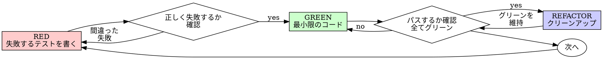

# テスト駆動開発（TDD）

## 概要

先にテストを書く。失敗を見る。パスする最小限のコードを書く。

**コアプリンシパル:** テストが失敗するのを見ていなければ、正しいことをテストしているか分からない。

**このルールの文字通りの違反は、精神的な違反。**

## 使用タイミング

**常に:**
- 新機能
- バグ修正
- リファクタリング
- 動作の変更

**例外（パートナーに確認）:**
- 使い捨てのプロトタイプ
- 生成されたコード
- 設定ファイル

「今回だけ TDD をスキップする」と考えているか？ STOP。それは合理化。

## 鉄則

```
失敗するテストなしにプロダクションコードを書いてはならない
```

テストの前にコードを書いた？ 削除する。最初からやり直す。

**例外なし:**
- 「参考として」保持しない
- テストを書きながら「適応」しない
- 見ない
- 削除とは削除のこと

テストから新しく実装する。以上。

## レッド-グリーン-リファクタリング



### RED — 失敗するテストを書く

何が起こるべきかを示す一つの最小限のテストを書く。

**良い例:**
```typescript
test('失敗した操作を3回リトライする', async () => {
  let attempts = 0;
  const operation = () => {
    attempts++;
    if (attempts < 3) throw new Error('fail');
    return 'success';
  };

  const result = await retryOperation(operation);

  expect(result).toBe('success');
  expect(attempts).toBe(3);
});
```
明確な名前、実際の動作をテスト、一つのこと

**悪い例:**
```typescript
test('リトライが機能する', async () => {
  const mock = jest.fn()
    .mockRejectedValueOnce(new Error())
    .mockRejectedValueOnce(new Error())
    .mockResolvedValueOnce('success');
  await retryOperation(mock);
  expect(mock).toHaveBeenCalledTimes(3);
});
```
曖昧な名前、コードではなくモックをテスト

**要件:**
- 一つの動作
- 明確な名前
- 実際のコード（やむを得ない場合を除きモックを使わない）

### RED を確認する — 失敗するのを見る

**必須。絶対にスキップしない。**

```bash
pnpm --filter <package> test path/to/test.test.ts
```

確認:
- テストが失敗する（エラーではない）
- 失敗メッセージが期待通り
- 機能が欠けているために失敗する（タイポではない）

**テストがパスした？** 既存の動作をテストしている。テストを修正する。

**テストがエラーになった？** エラーを修正し、正しく失敗するまで再実行。

### GREEN — 最小限のコード

テストをパスさせる最もシンプルなコードを書く。

**良い例:**
```typescript
async function retryOperation<T>(fn: () => Promise<T>): Promise<T> {
  for (let i = 0; i < 3; i++) {
    try {
      return await fn();
    } catch (e) {
      if (i === 2) throw e;
    }
  }
  throw new Error('unreachable');
}
```
パスするのに十分なだけ

**悪い例:**
```typescript
async function retryOperation<T>(
  fn: () => Promise<T>,
  options?: {
    maxRetries?: number;
    backoff?: 'linear' | 'exponential';
    onRetry?: (attempt: number) => void;
  }
): Promise<T> {
  // YAGNI
}
```
過剰設計

機能を追加したり、他のコードをリファクタリングしたり、テストを超えて「改善」したりしない。

### GREEN を確認する — パスするのを見る

**必須。**

```bash
pnpm --filter <package> test path/to/test.test.ts
# または全テスト
pnpm -r test
```

確認:
- テストがパスする
- 他のテストがまだパスする
- 出力がクリーン（エラーや警告なし）

**テストが失敗した？** コードを修正する、テストではない。

**他のテストが失敗した？** 今すぐ修正する。

### REFACTOR — クリーンアップ

グリーン後のみ:
- 重複を除去する
- 名前を改善する
- ヘルパーを抽出する

テストをグリーンに保つ。動作を追加しない。

## 検証チェックリスト

作業が完了したとマークする前に:

- [ ] すべての新しい関数/メソッドにテストがある
- [ ] 実装する前に各テストが失敗するのを見た
- [ ] 各テストが期待通りの理由で失敗した（機能が欠けている、タイポではない）
- [ ] 各テストをパスさせる最小限のコードを書いた
- [ ] すべてのテストがパスする
- [ ] 出力がクリーン（エラーや警告なし）
- [ ] テストが実際のコードを使っている（やむを得ない場合のみモック）
- [ ] エッジケースとエラーがカバーされている

すべてのボックスにチェックできない？ TDD をスキップした。最初からやり直す。

## 一般的な言い訳

| 言い訳 | 実態 |
|--------|------|
| 「テストするには単純すぎる」 | 単純なコードも壊れる。テストに 30 秒。 |
| 「後でテストする」 | 即座にパスするテストは何も証明しない。 |
| 「後でのテストも同じ目標を達成する」 | 後のテスト = 「これは何をするか？」 先のテスト = 「これは何をすべきか？」 |
| 「すでに手動でテストした」 | アドホック ≠ 体系的。記録なし、再実行不可。 |
| 「X 時間を削除するのは無駄」 | サンクコストの誤謬。未検証のコードを保持することが技術的負債。 |
| 「参考として保持し、先にテストを書く」 | 適応させる。それは後のテスト。削除とは削除のこと。 |
| 「先に探索する必要がある」 | 良い。探索を捨て、TDD で始める。 |
| 「TDD は遅くなる」 | TDD はデバッグより高速。実用的 = テストファースト。 |

## Red Flags — STOP して最初からやり直す

- テスト前のコード
- 実装後のテスト
- テストが即座にパスする
- テストが失敗した理由を説明できない
- 「後で」追加されるテスト
- 「今回だけ」と合理化している
- 「すでに手動でテストした」
- 「後のテストも同じ目標を達成する」

**これらはすべて: コードを削除する。TDD で最初からやり直す。**

## バグ修正の例

**バグ:** 空のメールが受け入れられる

**RED:**
```typescript
test('空のメールを拒否する', async () => {
  const result = await submitForm({ email: '' });
  expect(result.error).toBe('メールアドレスは必須です');
});
```

**RED を確認する:**
```bash
$ pnpm --filter frontend test
FAIL: expected 'メールアドレスは必須です', got undefined
```

**GREEN:**
```typescript
function submitForm(data: FormData) {
  if (!data.email?.trim()) {
    return { error: 'メールアドレスは必須です' };
  }
  // ...
}
```

**GREEN を確認する:**
```bash
$ pnpm --filter frontend test
PASS
```

**REFACTOR:** 必要に応じて複数フィールドのバリデーションを抽出。

## 詰まった時

| 問題 | 解決策 |
|------|--------|
| テスト方法が分からない | 望ましい API を書く。先にアサーションを書く。パートナーに確認。 |
| テストが複雑すぎる | 設計が複雑すぎる。インターフェースを単純化する。 |
| すべてをモックしなければならない | コードが結合しすぎている。依存性注入を使う。 |
| テストのセットアップが巨大 | ヘルパーを抽出する。それでも複雑なら、設計を単純化する。 |

## テストアンチパターン

モックやテストユーティリティを追加する時は、`testing-anti-patterns.md` を参照:
- 実際の動作ではなくモックの動作をテストする
- プロダクションクラスにテスト専用メソッドを追加する
- 依存関係を理解せずにモックする

## 最終ルール

```
プロダクションコード → テストが存在してまず失敗した
それ以外 → TDD ではない
```

パートナーの許可なしに例外なし。
