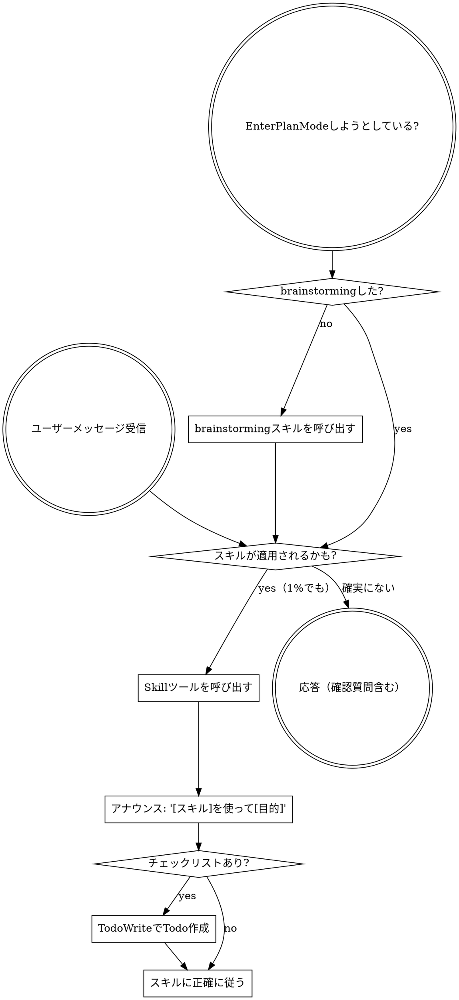

<SUBAGENT-STOP>
サブエージェントとして特定タスクを実行するために派遣された場合、このスキルをスキップすること。
</SUBAGENT-STOP>

<EXTREMELY-IMPORTANT>
スキルが適用される可能性が1%でもあると思ったら、必ずそのスキルを呼び出すこと。

スキルが適用される場合は選択の余地はない。必ず使うこと。

これは交渉の余地がない。任意ではない。理屈で回避することはできない。
</EXTREMELY-IMPORTANT>

## 指示の優先順位

スキルはデフォルトのシステムプロンプト動作を上書きするが、**ユーザーの指示が常に最優先**:

1. **ユーザーの明示的な指示** (CLAUDE.md、直接の依頼) — 最高優先度
2. **スキル** — デフォルトのシステム動作を上書き
3. **デフォルトのシステムプロンプト** — 最低優先度

CLAUDE.md に「TDDを使うな」と書いてあって、スキルに「常にTDDを使え」と書いてあれば、ユーザーの指示に従う。

## スキルのアクセス方法

**Claude Code では:** `Skill` ツールを使う。スキルを呼び出すとその内容がロードされて提示される — 内容に直接従う。スキルファイルに `Read` ツールを使わないこと。

## スキルの使い方

### ルール

**関連スキルまたは要求されたスキルを、すべての応答やアクションの前に呼び出す。** 1%でもスキルが適用されるかもしれないと思ったら呼び出して確認する。呼び出したスキルが状況に合わなくても、使わなくてよい。

### スキップを正当化している危険サイン

これらの考えは **STOP** のサイン — 合理化している:

| 考え | 実態 |
|------|------|
| "これは単純な質問" | 質問はタスク。スキルを確認する。 |
| "先にコンテキストが必要" | スキル確認は確認質問の前。 |
| "先にコードベースを探索する" | スキルが探索方法を教える。先に確認。 |
| "git/ファイルを素早く確認できる" | ファイルには会話コンテキストがない。スキルを確認。 |
| "先に情報を集める" | スキルが情報収集方法を教える。 |
| "正式なスキルは必要ない" | スキルがあれば使う。 |
| "このスキルは覚えている" | スキルは進化する。最新版を読む。 |
| "これはタスクではない" | アクション = タスク。スキルを確認。 |
| "スキルは大げさ" | 単純なことが複雑になる。使うこと。 |
| "これだけ先にやる" | 何かをする前に確認する。 |
| "概念は分かってる" | 概念を知ること ≠ スキルを使うこと。呼び出す。 |

### スキルの優先順位

複数のスキルが適用できる場合:

1. **プロセス系スキルを優先** (brainstorming, debugging) — タスクへのアプローチ方法を決める
2. **実装系スキルを次に** — 実行をガイドする

"Xを作ろう" → まず brainstorming、次に実装スキル。
"このバグを修正" → まず debugging、次にドメイン固有スキル。

### スキルの種類

**厳格型** (TDD, debugging): 正確に従う。規律から外れない。

**柔軟型** (patterns): 原則をコンテキストに合わせて適用。

スキル自体がどちらかを示している。

### ユーザーの指示

指示は「何を」を言うもので、「どのように」ではない。「Xを追加する」や「Yを修正する」はワークフローをスキップする理由にならない。
